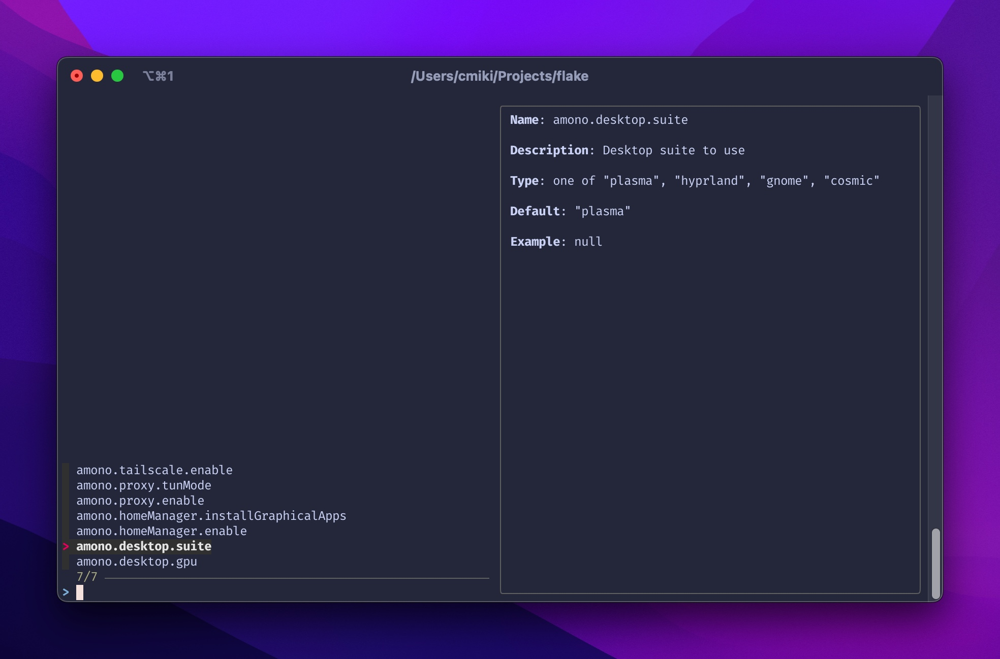

# ilgaak

See through custom NixOS module options with `fzf`.



> [Snow goggles](https://en.wikipedia.org/wiki/Snow_goggles) (Inuktitut: ilgaak or iggaak, syllabics: ᐃᓪᒑᒃ or ᐃᒡᒑᒃ; Central Yupik: nigaugek, nigauget) are a type of eyewear traditionally used by the Inuit and the Yupik peoples of the Arctic to prevent snow blindness.

## Usage

ilgaak is a flake module powered by [flake-parts](https://flake.parts/).

To get started, [install flake-parts](https://flake.parts/getting-started) in the flake that contains your NixOS configuration, and import this module:

```nix
{
  inputs = {
    ilgaak = {
      url = "github:AsterisMono/ilgaak";
      inputs.nixpkgs.follows = "nixpkgs";
    };
  };

  outputs = inputs@{ self, ... }:
    inputs.flake-parts.lib.mkFlake { inherit inputs; } {
      imports = [
        inputs.ilgaak.flakeModule
      ];

      ilgaak.enable = true;

      flake = {
        # It is recommended to expose all your nixosModules here
        nixosModules = {
          moduleA = import ./nixosModules/moduleA.nix;
          moduleB = import ./nixosModules/moduleB.nix;
        };
      };
    };
}
```

Now you can run:

```sh
nix run .#packages.x86_64-linux.ilgaak-nixos
```

## Module sets

By default ilgaak will look for your NixOS modules in `flake.nixosModules`. If that's not the case, you can override this behavior with:

```nix
ilgaak.moduleSets = [
  {
    name = "my-nixos-moduleset";
    modules = [
      ./nixosModules/moduleA.nix
      ./nixosModules/moduleB.nix
    ];
  }
];
```

Each module set generates a viewer package that, when run, provides an interactive fzf-based interface for browsing and searching all configuration options within that module set.

If you defined a custom module set, you can use:

```sh
nix run .#packages.x86_64-linux.ilgaak-${nameOfTheModuleSet}
```